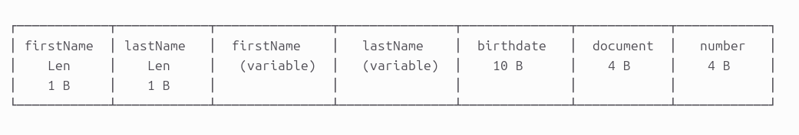
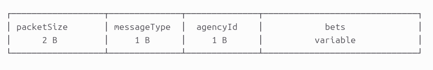
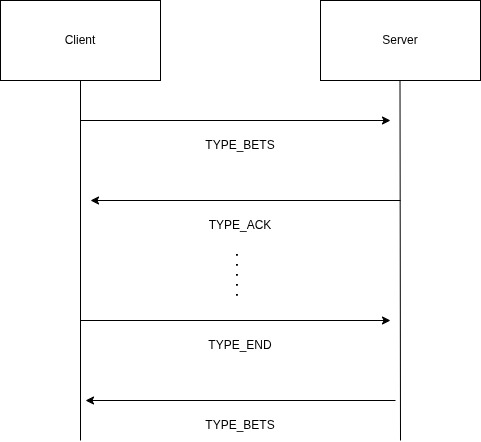
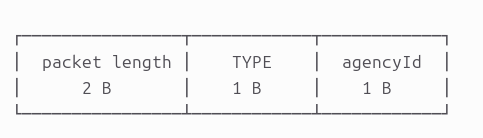

# Informe de implementación

## Protocolo de comunicación

En el protocolo implementado, definimos tres tipos principales de mensajes:

* `TYPE_BETS`: referencia un conjunto de apuestas, todas juntas en un batch. 

    Las apuestas forman un paquete e la siguiente forma:

    

    Mientras los batch tiene esta estructura:

    

    Las apuestas, además de sus datos propios, llevan los campos `firstNameLen` y `lastNameLen` de manera que pueda saberse la longitud y parsearse estos campos sin la necesidad de usar un tamaño arbitrario y desperdiciar espacio.

    Por otro lado, cada batch lleva el identificador de agencia y un conjunto de apuestas serializadas. Además, llevan en su primer campo el tamaño del paquete entero. Esto permite leer la cantidad exacta de bytes que corresponde, ayudando al manejo de los problemas de short read y short write.

Además, las estructuras principales del protocolo quedaron separadas por responsabilidad. La parte de bet se encarga de serializar y deserializar una sola apuesta, la parte de batch agrupa varias apuestas y prepara el paquete que se envía por socket, y la parte de ack define la confirmación del servidor para cada batch recibido. Esto mantiene el protocolo más claro y facilita mantener o extender cada pieza por separado.

El flujo queda entonces muy claro: el cliente envía un batch, el servidor lo procesa y confirma con ACK, y recién después el cliente continúa con el siguiente batch o con el mensaje final de cierre.

## Concurrencia

El servidor atiende cada conexión con un hilo independiente, lo que permite manejar varias agencias en paralelo sin bloquear el resto del sistema. El almacenamiento compartido se protege con un lock para evitar condiciones de carrera al registrar apuestas y al consultar el estado del lote.

Además, se usa una condición compartida para esperar el quorum de agencias necesarias antes de continuar con el cálculo de resultados. Así, el servidor no avanza antes de tener la cantidad mínima de participantes requerida y, al mismo tiempo, puede seguir respondiendo a nuevas conexiones mientras espera.

## Graceful shutdown

El cliente usa un context y un goroutine para detectar SIGTERM y cerrar la conexión de forma controlada. De esa manera, el cierre no se trata como un error fatal sino como una interrupción prevista del flujo de trabajo.

En el servidor, el evento de apagado marca el cierre global del servicio, notifica las condiciones en espera, cierra sockets activos y hace join de los threads. Esto evita que el proceso quede bloqueado en tareas pendientes o en espera de clientes que ya no deberían seguir activos.

